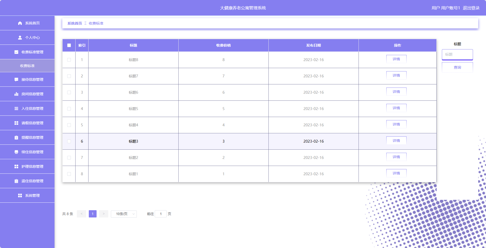
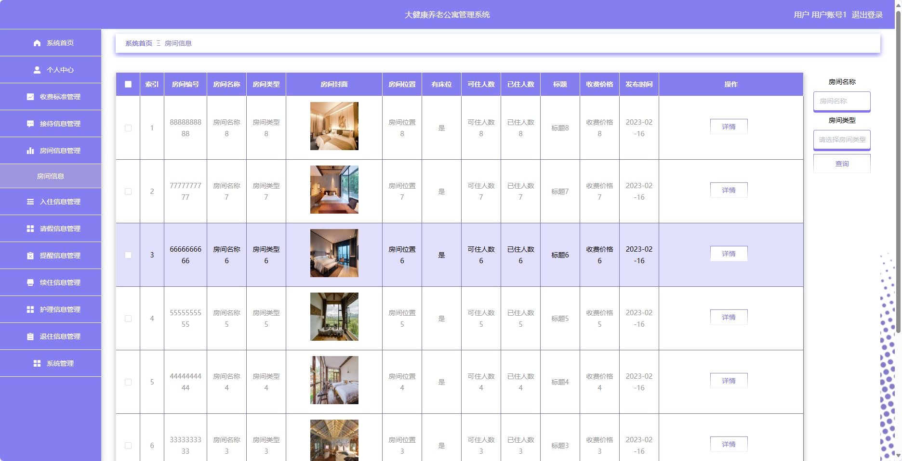
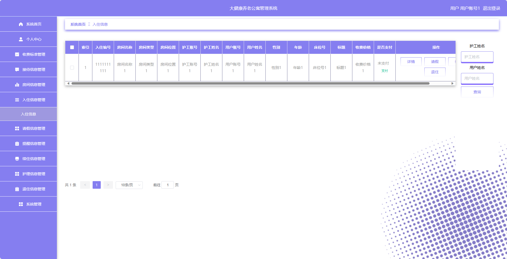
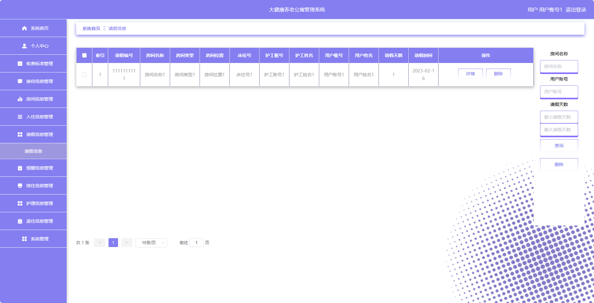
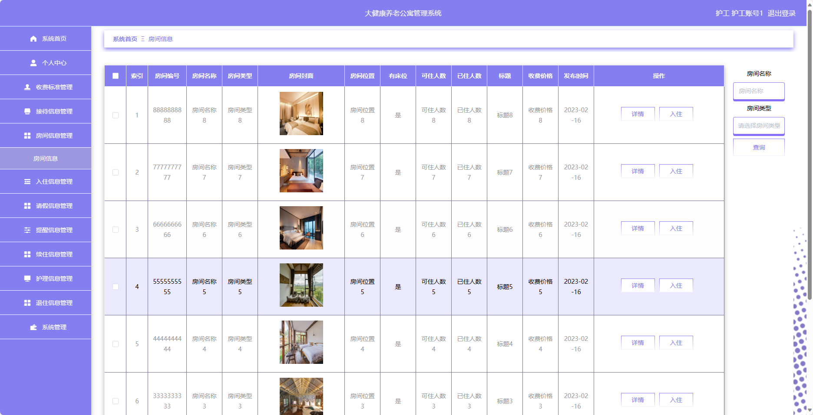
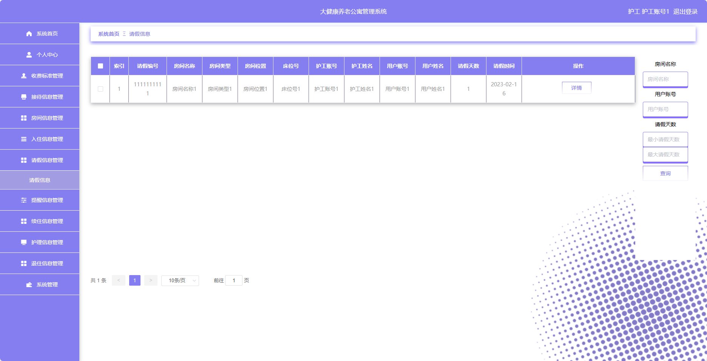
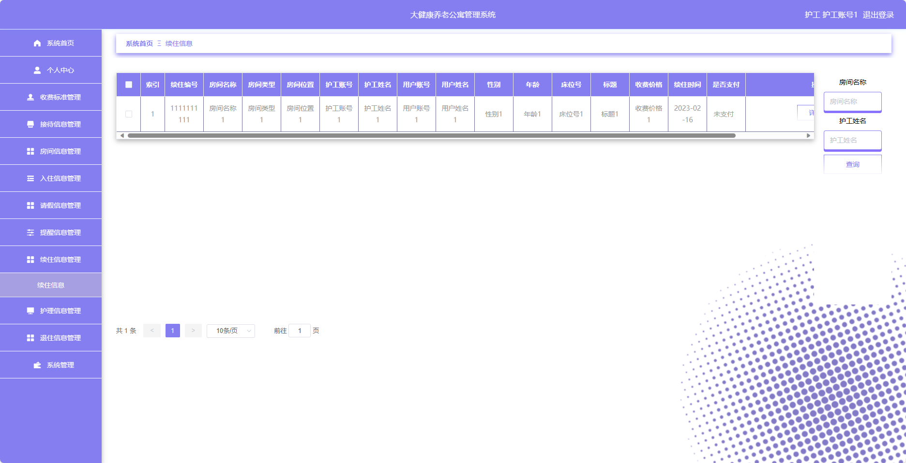

## 基于SpringBoot的大健康养老公寓管理系统

###  获取sql数据库文件: 从戎源码网 (https://armycodes.com/) QQ: 386869957 QQ群: 377586148
###  所有系统地址: (https://github.com/YuLin-Coder/AllProjectCatalog) 
###  所有项目以及源代码本人均调试运行无问题 可支持远程安装部署调试、定制修改、代码讲解

## 项目介绍
基于SpringBoot的大健康养老公寓管理系统，系统包含两种角色：管理员、用户,系统分为前台和后台两大模块，主要功能如下。

### 【管理员】:
- 个人中心：管理个人信息和账户。
- 用户管理：管理系统中的用户信息。
- 护工管理：管理系统中的护工信息。
- 收费标准管理：管理养老公寓的收费标准。
- 接待信息管理：管理接待信息。
- 房间类型管理：管理房间的类型信息。
- 房间信息管理：管理房间的基本信息。
- 入住信息管理：管理入住信息。
- 请假信息管理：管理请假申请。
- 提醒信息管理：管理系统发送的提醒信息。
- 续住信息管理：管理续住信息。
- 护理信息管理：管理护理服务的相关信息。
- 退住信息管理：管理退住信息。
- 系统管理：修改个人密码和其他系统设置。

### 【用户】:
- 个人中心：管理个人信息和账户。
- 收费标准管理：查看和管理养老公寓的收费标准。
- 接待信息管理：查看和管理接待信息，包括预约接待等。
- 房间信息管理：查看和管理房间的基本信息。
- 入住信息管理：申请和管理入住信息。
- 请假信息管理：提交和管理请假申请。
- 提醒信息管理：接收和管理系统发送的提醒信息。
- 续住信息管理：申请和管理续住信息。
- 护理信息管理：查看和管理护理服务的相关信息。
- 退住信息管理：申请和管理退住信息。
- 系统管理：修改个人密码和其他系统设置。

### 【护工】:
- 个人中心：管理个人信息和账户。
- 收费标准管理：查看养老公寓的收费标准。
- 接待信息管理：查看和管理接待信息。
- 房间信息管理：查看和管理房间的基本信息。
- 入住信息管理：管理入住信息。
- 请假信息管理：提交和管理请假申请。
- 提醒信息管理：接收和管理系统发送的提醒信息。
- 续住信息管理：申请和管理续住信息。
- 护理信息管理：管理护理服务的相关信息。
- 退住信息管理：申请和管理退住信息。
- 系统管理：修改个人密码和其他系统设置。

## 项目技术
- 编程语言：Java
- 数据库：MySQL
- 项目管理工具：Maven
- 前端技术：HTML、CSS、JavaScript、Jquery、Vue
- 后端技术：Spring、SpringMVC、MyBatis

## 运行环境
- JDK版本：JDK1.8及以上
- 开发工具：IDEA、Ecplise、Myecplise都可以
- 数据库: MySQL5.7及以上
- Maven：maven3.0及以上
- Node：14.14.0及以上

## 运行截图

